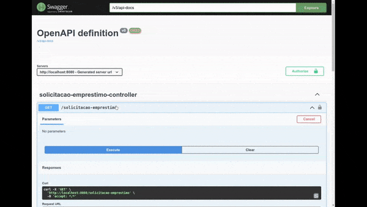
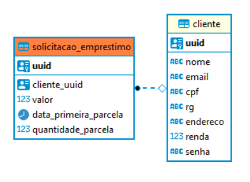

## Executando o projeto
1. comando para criar banco postgres utilizando o docker:
   `docker run --name postgres -e POSTGRES_DB=evolution -e POSTGRES_PASSWORD=123456 -p 5432:5432 -d postgres`
2. comamando para compliar e executar o projeto:
   `./gradlew tasks bootRun`
3. acesse o link http://localhost:8080/swagger-ui.html

## Escolhas e justificativas:
* **Spring framework:**
framework padrão de mercado, versátil, flexível, possui forte retrocompatibilidade,
se preocupa com design de APIs, adota altos padrões de qualidade de código,
foca em qualidade, agilidade e simplicidade, maduro, 
em constante evolução e com bastante suporte da comunidade.

* **Spring Boot:**
forma mais simples de utilizar o spring framework, com gerenciamento das dependências
e auto configuração, desta forma reduz drasticamente o tempo gasto em configuração do projeto,
otimizando a produção. Possui servidores HTTP embutidos como o Tomcat, podendo testar páginas web.

* **Spring Data JDBC:**
A principal API de persistência para bancos de dados relacionais no mundo Java é certamente JPA,
mas o o Spring Data JDBC pretende ser muito mais simples conceitualmente, adotando as seguintes decisões de design:
  * Se você carregar uma entidade, as instruções SQL serão executadas. Feito isso, você tem uma entidade completamente carregada. Nenhum carregamento lento (_lazy loading_) ou armazenamento em cache é feito.
  * Se você salvar uma entidade, ela será salva. Se você não fizer isso, isso não acontecerá. Não há rastreamento sujo e nenhuma sessão.
  

* **Spring Security:**
é uma estrutura de autenticação e controle de acesso poderosa e altamente personalizável. É o padrão de fato para proteger aplicativos baseados em Spring.

* **JWT:**
é um padrão aberto que permite que duas partes enviem dados e informações com segurança como objetos JSON. Essas informações podem ser verificadas e confiáveis ​​porque são assinadas digitalmente. 
Em conjunto com o _Spring Security_ permite que o usuário continue fazendo requisições para a API autenticada de forma _stateless_.

* **Spring Validation:**
prove uma serie de validações via _annotation_ que facilitam muito o desenvolvimento ajudam a garantir o formato dos dados na entrada, nesse projeto usamos uma serie delas como:
  * @Email
  * @NotBlank
  * @CPF
  * @FutureOrPresent
  * @Min
  * @Max

* **Flyway:**
é uma ferramenta de migração de banco de dados de código aberto. Ele favorece fortemente a simplicidade e a convenção sobre a configuração.

* **PostgreSQL:**
é um sistema gerenciador de banco de dados de código aberto dos mais avançados existentes no mercado.
Suporta a criptografia dos dados em repouso que é necessaria para atender a Lei Geral de Proteção de Dados (Lei 13.709/2018 - LGPD)

* **Swagger:**
é um framework composto por diversas ferramentas que, independente da linguagem, auxilia a descrição,
consumo e visualização de serviços de uma API REST.
Para auxiliar na utilização da API, o Swagger dispõe de ferramenta para deixar a visualização mais intuitiva,
permitindo também que interajam com a API.

* **Docker:**
tendo o sistema rodando em containers torna mais fácil tanto rodar o sistema localmente quanto o deploy em produção.

## Modelo de dados

## Evoluções
* validação/ativação de email (garantir que o cliente é dono do email)
* captcha no fluxo de cadastro de cliente
* frontend
* backoffice para avaliação das propostas de empréstimo com anonimização  dos dados

## Referencias
- https://spring.io/guides
- https://github.com/spring-projects/spring-security-samples/tree/main/servlet/spring-boot/java/jwt/login
- https://www.toptal.com/java/rest-security-with-jwt-spring-security-and-java
- https://github.com/spring-projects/spring-data-examples
- https://www.zup.com.br/blog/spring-validation-o-que-e